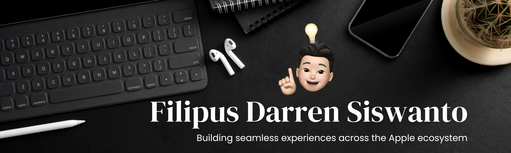

  

<h3 align="center">Hi, I'm Darren 👋</h3>

<h3 align="center">Computer Science Student · Software Engineer in training · AI/ML Enthusiast</h3>

  

  
  

---

### 🚀 About Me

- 🎓 7th semester **Computer Science** student at **BINUS University**
- 🍎 Intern at the **Apple Developer Academy @ BINUS Tangerang**
- 💻 Exploring both **Software Engineering** and **AI/ML Engineering**
- 🌱 Always picking up new tools, languages, and ideas
- 📌 Project highlights coming soon, check my pinned repos below

---

### 💼 Experience

**Intern, Apple Developer Academy @ BINUS Tangerang**

---

<h3 align="center">🛠️ Tech Stack</h3>

  

Swift / SwiftUI · Python · C++ · SQL

<h3 align="center">🤝 Soft Skills</h3>

<table align="center">
  <tr>
    <td align="center" width="140">🎤 <b>Public Speaking</b></td>
    <td align="center" width="140">🤝 <b>Teamwork</b></td>
    <td align="center" width="140">🧠 <b>Critical Thinking</b></td>
    <td align="center" width="140">🌱 <b>Lifelong Learning</b></td>
  </tr>
</table>

---

### 📊 GitHub Stats

  
  

  

---

  <i>📬 Let's connect! I'm always open to chat about software engineering, AI/ML, or Apple platform development.</i>

